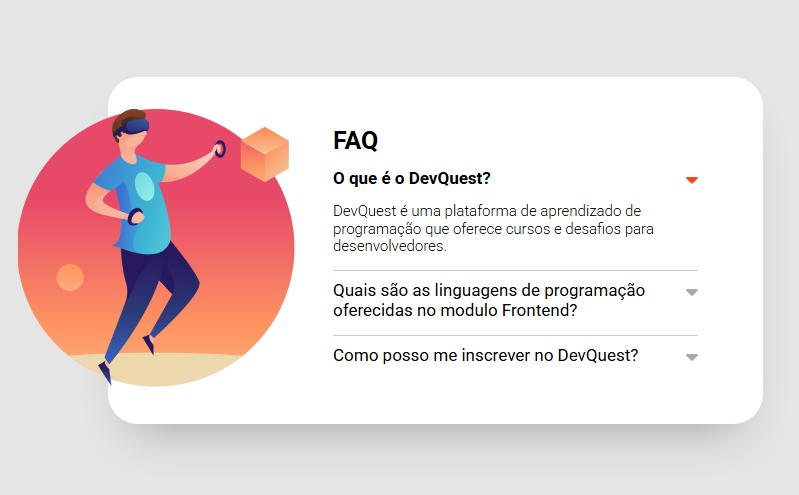
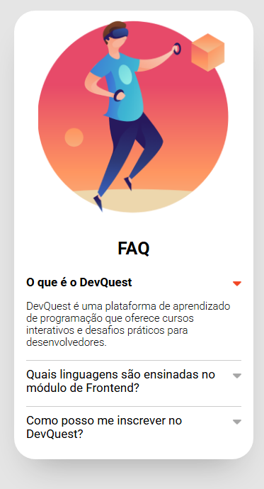
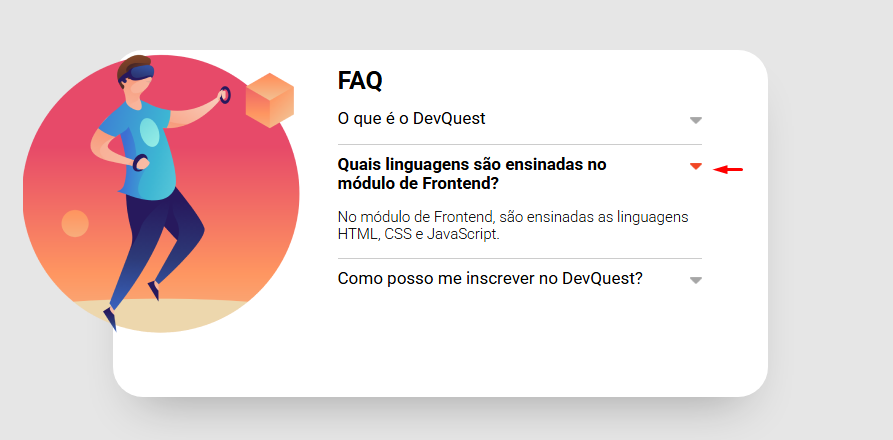

# Arcodeon

<b>Este projeto é o resultado de um exercício do módulo de JavaScript, proposto pelo curso DevQuest.

## Visão Geral 

###  Projeto 

<b> O objetivo é desenvolver uma página com estrutura do tipo Arcondeon, como interação para expandir ou retrair os itens.

###  Desafio

<b>O desafio consiste em desenvolver uma página a partir dos designs fornecidos, com estrutura do tipo Arcondeon, que é FAQ de perguntas e respostas. Os itens (perguntas e respostas) devem expandir ou retrair ao clicar nos icones de setas. 

### Funcionalidades 
<ul>
<li>Ao clicar nos icones de setas, os itens (perguntas e respostas) devem expandir ou retrair</li>
</ul>

### Capturas de tela 

Preview:  
  
    
Preview - mobile:  
  
   

Preview da interação:   
  
    

### Links 
 
<ul>
<li><a href="https://github.com/fernanda-nunes/acordeon" target="_blank"> Repositórios</a></li>
<li><a href="https://fernanda-nunes.github.io/acordeon/" target="_blank"> Site ao vivo</a></li>
</ul>
 

## O que eu aprendi 

<b> Durante o desenvolvimento deste projeto, tive a oportunidade de consolidar e expandir minhas habilidades em desenvolvimento front-end.
